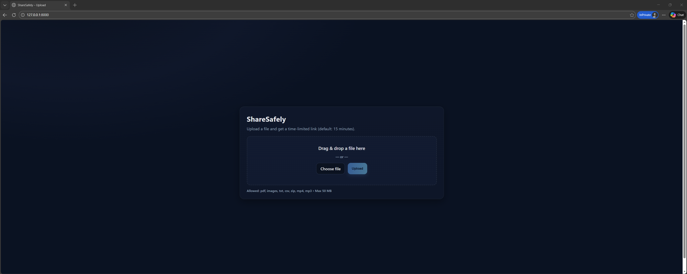
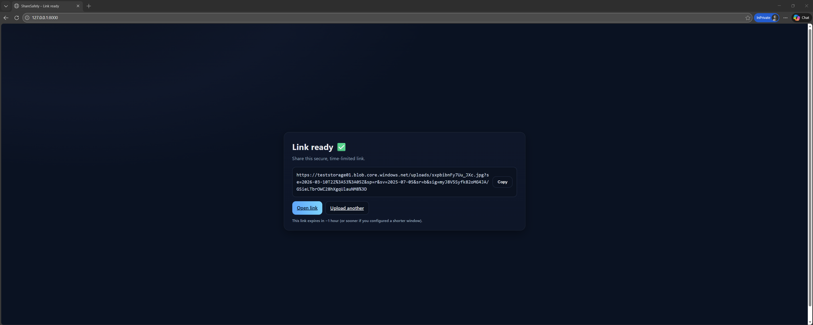

# ShareSafely (Azure Blob Secure File Sharing)

ShareSafely is a secure file-sharing web application built with Python, Flask, and Azure Blob Storage.

It allows users to upload files and generate **time-limited secure download links** using Azure SAS tokens.

This project demonstrates secure cloud storage patterns and web application deployment on Azure.

## Overview

ShareSafely provides a lightweight interface for securely sharing files without exposing storage containers publicly.

The application:

- Accepts file uploads through a Flask web interface
- Stores files in Azure Blob Storage
- Generates **temporary SAS download links**
- Automatically expires access after a configured amount of time

This demonstrates a real-world **secure file sharing architecture** using Azure storage primitives.

## Screenshots

### Upload Page

### Success Page

## Tech Stack

- Python
- Flask
- Azure Blob Storage
- Azure SAS Tokens
- Azure App Service
- HTML / Jinja Templates

## Architecture

User Upload  
↓  
Flask Web App  
↓  
Azure Blob Storage  
↓  
SAS Token Generation  
↓  
Secure Download Link

## Features

- Secure file uploads
- Azure Blob Storage integration
- Time-limited SAS download links
- Configurable link expiration window
- File size limits (50 MB)
- File type restrictions

## Security Considerations/Concerns

Files are accessed using **temporary SAS tokens**, preventing direct public access to storage containers.

Environment variables are used to store connection strings instead of hardcoding credentials.

## Deployment

This project was developed locally using Flask and deployed to **Azure App Service**.

The application connects to **Azure Blob Storage** to store uploaded files and generate secure temporary download links.

## Known Issues / Future Improvements
- Automatic deletion of expired blobs
- Drag-and-drop upload interface
- Azure Key Vault integration for secret management
- Upload progress indicator

## License
MIT License

## Acknowledgements

Inspired by the cloud-engineering-projects series by @madebygps for AZ-104 learning.

Built by Ted Maldonado as part of a hands-on cloud engineering portfolio.
