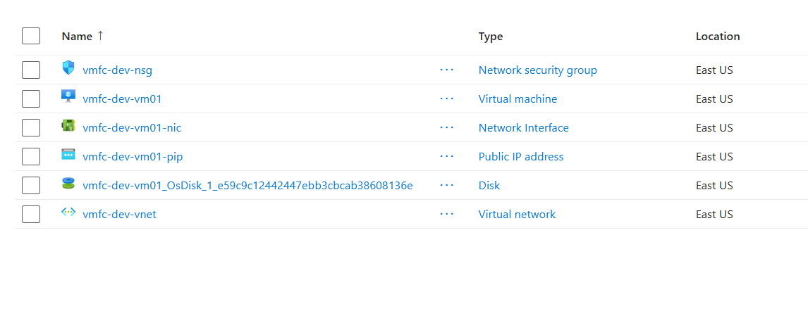

# VM Fleet Commander (Azure IaC VM Deployment)

VM Fleet Commander is an Infrastructure-as-Code project that provisions a complete Windows Server environment on Azure using **Bicep**.

It deploys a virtual network, subnet, network security group, public IP, network interface, and virtual machine as a single repeatable, parameterized deployment.

## Overview

VM Fleet Commander demonstrates modular Bicep authoring and reliable, repeatable Azure deployments without manual portal clicks.

The project:

- Deploys a virtual network and subnet with an associated NSG
- Provisions a Windows Server 2022 VM with a public IP and network interface
- Uses modular Bicep files (`network.bicep`, `virtualmachine.bicep`) orchestrated by a single `main.bicep`
- Accepts environment-specific values through a parameters file, so the same templates can deploy to dev, test, or prod with different inputs

This demonstrates a real-world **Infrastructure-as-Code workflow** using Azure Resource Manager and Bicep.

## Screenshots

### Deployed Resource Group

## Tech Stack

- Bicep
- Azure Resource Manager (ARM)
- Azure CLI
- Azure Virtual Machines
- Azure Virtual Network / NSG
- Git / GitHub

## Architecture

Parameters File
↓
main.bicep
↓
network.bicep (VNet, Subnet, NSG)
↓
virtualmachine.bicep (Public IP, NIC, VM)
↓
Deployed Azure Resource Group

## Features

- Modular Bicep templates with clear separation between networking and compute
- Parameterized deployments via a dedicated parameters file
- Secure password handling using Bicep's `@secure()` decorator
- Validated with `az bicep build` and `az deployment group what-if` before every deploy
- Deployed and verified end-to-end, including RDP access to the provisioned VM

## Security Considerations/Concerns

The VM admin password is passed in using Bicep's `@secure()` decorator, so it's never written to logs or deployment history, and it's excluded from the parameters file entirely — it's supplied at deploy time instead.

Deployments were run using a scoped Azure AD service principal with Contributor access limited to the target resource group, rather than a broad/standing account, to keep deployment permissions minimal.

## Deployment

This project is deployed using the Azure CLI and Bicep. Templates are compiled and validated locally, previewed with a `what-if` dry run, then deployed with `az deployment group create` against a target resource group.

## Known Issues / Future Improvements

- Move to Standard SKU public IP by default in the template (Basic SKU is being phased out on new subscriptions)
- Add outputs for VM public IP and resource IDs for easier post-deployment scripting
- Parameterize VM size and OS image per environment
- Add a CI/CD pipeline (GitHub Actions) to automate `what-if` validation on pull requests
- Auto-shutdown schedule to control dev/test costs

## License

[MIT License](https://github.com/polillao/cloud-engineering-projects/blob/main/LICENSE)

## Acknowledgements

Inspired by [@madebygps](https://github.com/madebygps) as part of the cloud-engineering-projects for the AZ-104.
Built by **[Ted Maldonado](https://github.com/polillao)** as part of a hands-on cloud automation portfolio.